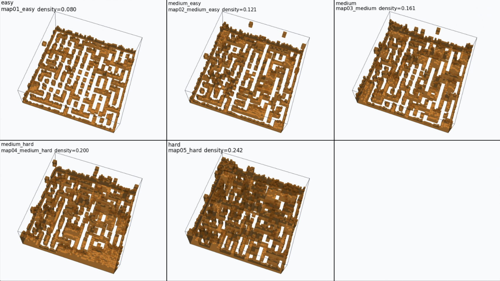

<div align="center">

# 3D Multi-Agent Pursuit-Evasion in Cluttered Environments

[](#installation)
[](#installation)

</div>

This repository contains a 3D multi-agent pursuit-evasion environment, MAPPO-based training code, evaluation scripts, robustness sweeps, and visualization tools for cluttered voxel maps. The default setting uses four pursuers, one evasive target, partial observability, obstacle-induced occlusion, asymmetric maneuverability, and a five-stage curriculum.

The implementation includes a local zero-communication policy variant, topology-aware guidance components, frontier-based exploration support, and evaluation pipelines for out-of-distribution maps, speed changes, yaw-rate restriction, observation noise, and action delay.

### Generalization Maps

The figure below shows the procedural urban-canyon maps used for out-of-distribution generalization evaluation, spanning `easy` to `hard` clutter regimes.

<p align="center">
  
</p>

### Policy Monitor Montage

The repository supports direct GIF export from the layered simulation monitor in `scripts/eval_policy_sim.py`, MP4 montage generation via `scripts/visualization/merge_eval_gifs_to_mp4.py`, and MP4-to-GIF conversion for README display.


## Overview

### Selected Stage-5 Benchmark

| Method | Actor Observation | Success Rate | Collision Rate |
| --- | --- | ---: | ---: |
| **Ours-Lite** | **50D, zero-communication** | **0.753 +/- 0.091** | **0.223 +/- 0.066** |
| Full Obs | 83D | 0.721 +/- 0.071 | 0.253 +/- 0.089 |
| Euclidean Guidance | 83D | 0.586 +/- 0.120 | 0.353 +/- 0.092 |

Protocol: Stage 5, 3 seeds, 500 episodes per seed.

## Key Features

- **Zero-communication pursuit policy**: a 50D local actor profile that removes teammate, slot, and encirclement observation blocks from a fuller 83D design.
- **Contribution-aware reward design**: discourages free-riding under local execution.
- **Curriculum with visibility gating**: the search-to-track handoff is conditioned on explored-volume thresholds.
- **3D topology-aware guidance**: 3D A*, layered frontier allocation, and tetrahedral tactical slots provide macro-scale geometric structure without explicit inter-agent messaging.
- **Urban-canyon generalization tooling**: includes a 2.5D map generator for OOD random-map evaluation sweeps.
- **Robustness-first evaluation**: ready-made sweeps for speed, yaw-rate restriction, observation noise, and action latency.

## Repository Layout

```text
src/                      core environment, policy, reward, and navigation code
scripts/                  primary train / eval entrypoints
scripts/analysis/         plotting and log-analysis utilities
scripts/sweeps/           robustness and batch-evaluation sweep drivers
scripts/data/             map-import and data-prep helpers
scripts/visualization/    auxiliary visualization tools
tests/                    regression tests and diagnostics
checkpoints/              curated checkpoints
docs/                     media assets used in documentation
artifacts/                bundled occupancy assets required by the default config
```

## Installation

The current codebase is easiest to use from a conda environment. The commands below install the core simulation and training stack first, then optional visualization extras.

```bash
conda create -n pursuit-evasion-3d python=3.10 -y
conda activate pursuit-evasion-3d

python -m pip install --upgrade pip
pip install numpy scipy pyyaml matplotlib pillow numba pytest
pip install torch

# Optional visualization / OOD map tooling
pip install pyvista moviepy

# Optional AirSim deployment and 3D rendering
pip install airsim
```

Notes:

- Install a CUDA-enabled PyTorch build if you plan to train on GPU.
- The default config expects the bundled occupancy asset at `artifacts/level_occupancy.npy`.
- `pillow` is used for `scripts/eval_policy_sim.py --gif ...`.
- `moviepy` is used for `scripts/visualization/merge_eval_gifs_to_mp4.py` and `scripts/visualization/convert_video_to_gif.py`.
- Example checkpoint layout is documented in `checkpoints/README.md`.

## Quick Start

### 1. Evaluate a Checkpoint in Vectorized Simulation

Recommended checkpoint layout:

```text
checkpoints/
  ours_stage5/
    policy.pt
    config.json
```

Run a deterministic Stage-5 sanity evaluation:

```bash
python scripts/eval_policy_episodes.py \
  --policy checkpoints/ours_stage5/policy.pt \
  --config checkpoints/ours_stage5/config.json \
  --stage-index 4 \
  --episodes 20 \
  --num-envs 8 \
  --device auto \
  --deterministic \
  --eval-tag release_eval \
  --output eval_logs/release_eval.jsonl
```

### 2. Watch the Policy in 3D AirSim Rendering

If you have the matching AirSim scene running, you can render the Stage-5 policy directly in 3D:

```bash
python scripts/test_policy_airsim.py \
  --policy checkpoints/ours_stage5/policy.pt \
  --config checkpoints/ours_stage5/config.json \
  --stage stage5_extreme_game \
  --episodes 1 \
  --steps 800 \
  --show-obstacles \
  --deterministic
```

If you only want a local visual sanity check without AirSim, use the built-in layered explorer instead:

```bash
python scripts/eval_policy_sim.py \
  --policy checkpoints/ours_stage5/policy.pt \
  --config checkpoints/ours_stage5/config.json \
  --stage-index 4 \
  --steps 1200 \
  --episodes 1 \
  --num-envs 1 \
  --device auto \
  --explore-live \
  --explore-live-path \
  --gif eval_logs/seed40.gif
```

This command is a practical first step for curating rollout clips. Export several seeds to `eval_logs/*.gif`, then merge them into a single montage MP4:

```bash
python scripts/visualization/merge_eval_gifs_to_mp4.py \
  --input-dir eval_logs \
  --output docs/merged_eval_gifs.mp4 \
  --fps 10
```

Finally, convert the merged MP4 into a GitHub-compatible GIF for the README:

```bash
python scripts/visualization/convert_video_to_gif.py \
  --input docs/merged_eval_gifs.mp4 \
  --output docs/merged_eval_gifs.gif \
  --fps 8 \
  --width 900
```

### 3. Launch the Full Five-Stage Curriculum

The default config already contains the complete Stage 1-5 curriculum.

```bash
python scripts/train_mappo_3d.py \
  --config src/config.yaml \
  --baseline ours \
  --device cuda \
  --num-envs 64 \
  --run-tag release_ours
```

Outputs are written to `runs/mappo_3d/default/<timestamp>_<run_tag>/`.

## Citation

Citation information is intentionally omitted in this anonymous version of the repository.

## License

License information is intentionally omitted in this anonymous version of the repository.
